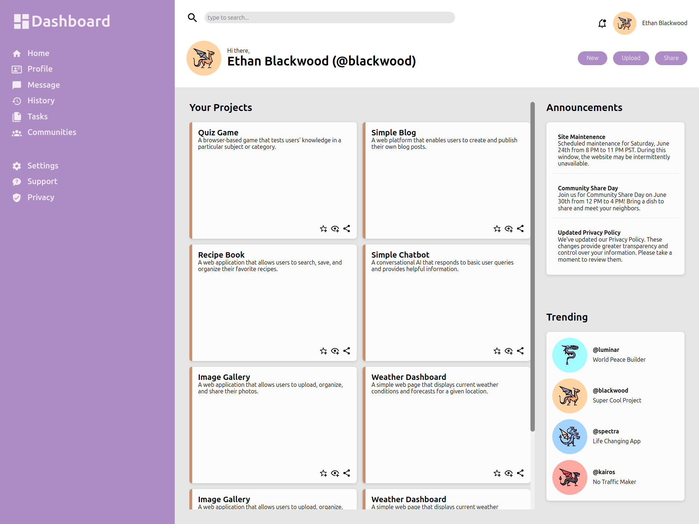

# Admin Dashboard

A simple admin dashboard project built with HTML and CSS, created as part of The Odin Project's Intermediate HTML and CSS curriculum.

## Description

This project is a basic implementation of an admin dashboard, demonstrating the use of HTML and CSS to create a responsive and visually appealing dashboard.

## Features

* Responsive design for a smooth user experience
* Basic styling with a modern aesthetic
* Customizable dashboard components

## Demo

[**Live Demo**](https://radix-ratio.github.io/admin-dashboard)  | [**Project Specs**](https://www.theodinproject.com/lessons/node-path-intermediate-html-and-css-admin-dashboard)

## Screenshots

## Getting Started

1. Clone the repository to your local machine.
2. Open the `index.html` file in a web browser to view the dashboard.

## License

This project is licensed under the MIT License. See [`LICENSE`](https://choosealicense.com/licenses/mit/) for details.

## Acknowledgments

- The Odin Project for providing the curriculum and resources

## Authors

- [Your GitHub Username](https://www.github.com/your-github-username)